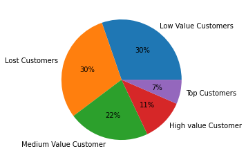

## Project Title 
Retail Customer Segmentation

## Problem Statment
* This project  is about a Superstore which caters to a vast variety of customers. Superstore’s manager has noticed that there are diminishing returns from the existing marketing strategies. Sales from the last 2 quarters have hit a plateau which has started to concern the store manager. 
* Store’s usual marketing campaigns includes unmonitored and untargeted approach which in the last quarter incurred some losses due to which the store manager started to look for areas of improvement. He found that the mass effectiveness of mass campaigns is very low as the cost is too high. The store already has an analytics team which has been collecting household level data from customers in the loyalty program.

## Datasets: Following csv files
* Transactio.csv
* Product.csv
* Promotions.csv
* Demogrpahics.csv
* Coupons.csv
* Coupon_redemption.csv
* Campaign.csv
* Campaign_description.csv

## What are the required python packages?
* Pandas
* Numpy
* Matplotlib
* Seaborn

## Approach use for Customer Segmentation
Here RFM Segmentation is used for Customer Segementation
* Recency: How recently has the customer made a transaction with us
* Frequency: How frequent is the customer in ordering/buying some product from us
* Monetary: How much does the customer spend on purchasing products from us.

## Rating Customer based upon the RFM score
* rfm score >4.5 : Top Customer
* 4.5 > rfm score > 4 : High Value Customer
* 4>rfm score >3 : Medium value customer
* 3>rfm score>1.6 : Low-value customer
* rfm score<1.6 :Lost Customer

## Final Output

## Tutorial video  

